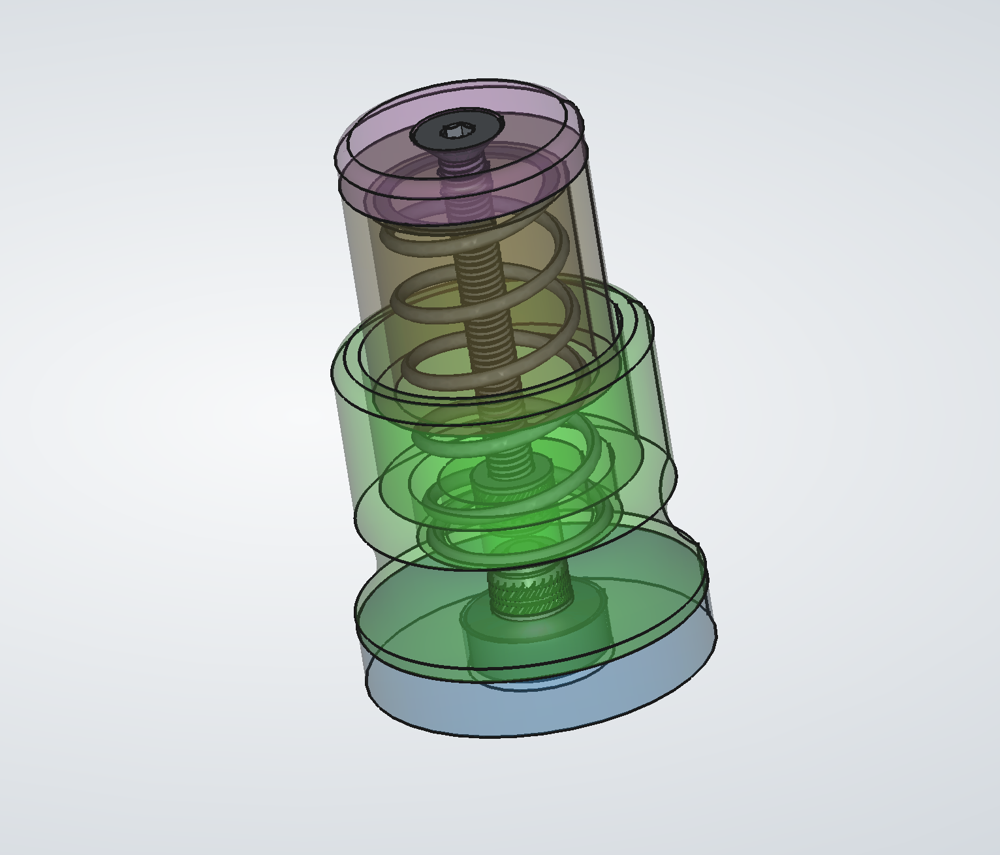

# Parametrized, magnetic PCB clamp #
I needed various heights of these to hold different boards under my microscope for inspection and rework.
They are parameterized for height, dimensions of base magnet, and heatset insert.
The pieces are each optimized to be printed with no support material.

